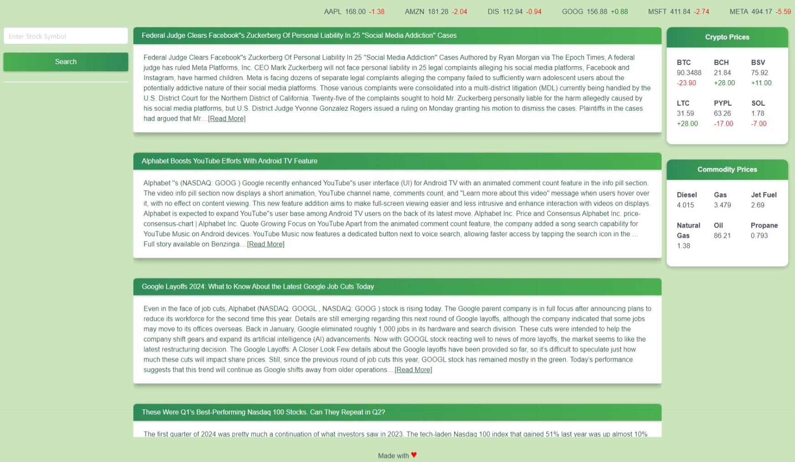

# Stock Ticker

## Description

This webpage was written to be able to display stock, crypto and commodity information for the user.
It allows the user to enter a stock to get information about.
As each search is completed, a button will be added below
the search form for easy access to search for the stock symbol again in the future.
Once a stock symbol has been searched for,
the current stock information will be displayed on top containing the symbol, current price, change, and percent change.
Displaying below that will be 10 financial news article snippets. The snippets will be related to a random symbol from the stock ticker list.
If the user searches for a stock, then the news article snippets will be updated to be about the stock symbol searched for.
We built this project because it gave us valuable experience practicing what we have learned about HTML, CSS and JS up until this point.

## Usage

To use the webpage, please navigate to https://mattm479.github.io/stock-ticker. You will need to input a stock symbol to view the information for a specific symbol and then click Search to view the stock information and news articles related to the symbol. This webpage will look similar to the screenshot below:

## License

License can be found [here](LICENSE).